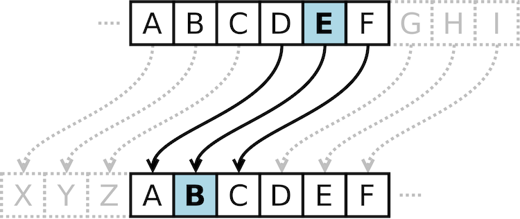
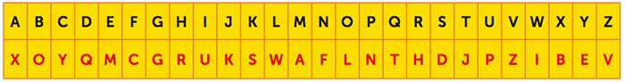

# Project: Decoder Ring

A project for the software engineering course for Thinkful.

---

> To install dependencies locally run the command:
>
>     npm i
>
> To run the tests, you can run the following command:
>
>      npm test
>
> To watch how the code you write affects the application website, you can run the following command. This command will start a server and take over your terminal window. To stop the server from running, you can press `Ctrl + C`.
>
>      npm start

---

## Summary

This project was designed to test the ability to build tricky algorithms in JavaScript as well as write unit tests with Mocha & Chai. HTML and CSS was supplied with starter code. The following skills were utilized:

- Installing packages via NPM.
- Modifying the package.json file with new scripts.
- Running tests from the command line.
- Writing JavaScript functions.
- Writing tests for specific functions.
- Iterating through strings, objects, and arrays.
- Debugging through reading errors and using the VSCode debugger.

---

> ## Requirements
>
> You are tasked with building functions for an application that will either encode or decode a string using a variety of ciphers. For each cipher, you should make a series of tests using Mocha & Chai to confirm that your cipher works.
>
> All of the functions can be found inside of the src/ directory. Each function and cipher is described below.
>
> Below is a checklist of what you need to accomplish.
>
> - Complete the caesar() function.
> - Write tests for the caesar() function.
> - Complete the polybius() function.
> - Write tests for the polybius() function.
> - Complete the substitution() function.
> - Write tests for the substitution() function.
>
> **Note:** Your submission will be tested on a total of 29 tests. 13 of those tests are hidden.

---

## Caesar Shift



The Caesar Shift is a type of substitution cipher originally used by Julius Caesar to protect messages of military significance. It relies on taking the alphabet and "shifting" letters to the right or left, based on the typical alphabetic order.

For example, if you were to "shift" the alphabet to the right by 3, the letter "A" would become "D".

    "thinkful" -> "wklqnixo"

When decoding the message, you need to know the number the original message was shifted by so that you can shift in the opposite direction.

    caesar()

The caesar() function in the src/caesar.js file has three parameters:

- **input** refers to the inputted text to be encoded or decoded.
- **shift** refers to how much each letter is "shifted" by. A positive number means shifting to the right (i.e. "A" becomes "D") whereas a negative number means shifting to the left (i.e. "M" becomes "K").
- **encode** refers to whether you should encode or decode the message. By default it is set to true.

When building the function, keep the following constraints and rules in mind:

- If the shift value is not present, equal to 0, less than -25, or greater than 25, the function should return false.
- Spaces should be maintained throughout, as should other non-alphabetic symbols.
- Capital letters can be ignored.
- If a letter is shifted so that it goes "off" the alphabet (e.g. a shift of 3 on the letter "z"), it should wrap around to the front of the alphabet (e.g. "z" becomes "c").

### Examples

```javascript
caesar("thinkful", 3); //> 'wklqnixo'
caesar("thinkful", -3); //> 'qefkhcri'
caesar("wklqnixo", 3, false); //> 'thinkful'

caesar("This is a secret message!", 8); //> 'bpqa qa i amkzmb umaaiom!'
caesar("BPQA qa I amkzmb umaaiom!", 8, false); //> 'this is a secret message!'

caesar("thinkful"); //> false
caesar("thinkful", 99); //> false
caesar("thinkful", -26); //> false
```

---

## Polybius Square

|       |     | 1   | 2   | 3   | 4   | 5   |
| ----- | --- | --- | --- | --- | --- | --- |
| **1** | -   | A   | B   | C   | D   | E   |
| **2** | -   | F   | G   | H   | I/J | K   |
| **3** | -   | L   | M   | N   | O   | P   |
| **4** | -   | Q   | R   | S   | T   | U   |
| **5** | -   | V   | W   | X   | Y   | Z   |

The Polybius Square is a cipher that is achieved by arranging a typical alphabet into a grid. Each letter is represented through a coordinate. For example, in the above table, the letter "B" would be represented by the numerical pair "21".

Typically, it is possible to arrange the letters however you like and read off the coordinates in whatever direction you like. In this example, the grid will be arranged as above and coordinates will be read by comparing the first digit to the number on the top of the table and the second digit to that on the left.

    thinkful" -> "4432423352125413"

When decoding the message, each pair of numbers is translated using the coordinates.

    polybius()

The polybius() function in the src/polybius.js file has two parameters:

- **input** refers to the inputted text to be encoded or decoded.
- **encode** refers to whether you should encode or decode the message. By default it is set to true.

When building the function, keep the following constraints and rules in mind:

- You are welcome to assume that no additional symbols will be included as part of the input. Only spaces and letters will be included.
- When encoding, your output should still be a string.
- When decoding, the number of characters in the string excluding spaces should be even. Otherwise, return false.
- Spaces should be maintained throughout.
- Capital letters can be ignored.
- The letters "I" and "J" share a space. When encoding, both letters can be converted to 42, but when decoding, both letters should somehow be shown.

### Examples

```javascript
polybius("thinkful"); //> "4432423352125413"
polybius("Hello world"); //> '3251131343 2543241341'

polybius("3251131343 2543241341", false); //> "hello world"
polybius("4432423352125413", false); //> "th(i/j)nkful
polybius("44324233521254134", false); //> false
```

---

## Substitution Cipher



The Substitution Cipher requires a standard alphabet and a substitution alphabet. Letters from the standard alphabet will be transposed to the standard alphabet. This cipher requires that the recipient have the substitution alphabet, otherwise it will be difficult for them to decode the message.

For example, in the image above, the word "HELLO" would be translated as follows:

- "H" becomes "R".
- "E" becomes "M".
- "L" becomes "W".
- "O" becomes "L".

This would result in the code "RMWWL". To decrypt this code, you would simply take the result and transpose back from the substitution alphabet to the standard alphabet.

    substitution()

The substitution() function in the src/substitution.js file has three parameters:

- **input** refers to the inputted text to be encoded or decoded.
- **alphabet** refers to substitution alphabet.
- **encode** refers to whether you should encode or decode the message. By default it is set to true.

When building the function, keep the following constraints and rules in mind:

- The input could include spaces and letters as well as special characters such as `#`, `$`, `*`, etc.
- Spaces should be maintained throughout.
- Capital letters can be ignored.
- The alphabet parameter must be a string of exactly 26 characters, which could include special characters such as `#`, `$`, `*`, etc. Otherwise, it should return false.
- All of the characters in the alphabet parameter must be unique. Otherwise, it should return false.

### Examples

```javascript
substitution("thinkful", "xoyqmcgrukswaflnthdjpzibev"); //> 'jrufscpw'
substitution("You are an excellent spy", "xoyqmcgrukswaflnthdjpzibev"); //> 'elp xhm xf mbymwwmfj dne'
substitution("jrufscpw", "xoyqmcgrukswaflnthdjpzibev", false); //> 'thinkful'

substitution("message", "$wae&zrdxtfcygvuhbijnokmpl"); //> "y&ii$r&"
substitution("y&ii$r&", "$wae&zrdxtfcygvuhbijnokmpl", false); //> "message"

substitution("thinkful", "short"); //> false
substitution("thinkful", "abcabcabcabcabcabcabcabcyz"); //> false
```
